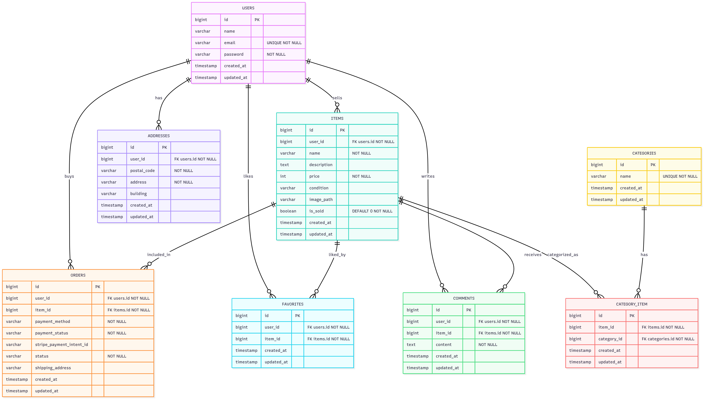

# mockcase_laravel
フリマアプリ（模擬案件） — Laravel 10 / PHP 8.2

ユーザー管理・商品出品/購入・コメント/お気に入り等を、基本設計書に準拠して実装しています。

---

## 1. 開発環境
- 言語: PHP 8.2 / JavaScript / HTML / CSS
- フレームワーク: Laravel 10 (Auth: Laravel Fortify)
- DB: MySQL 8.0
- 環境: Docker / docker compose
- メール: MailHog（ローカル通知確認用）

---

## 2. 実装機能
### ユーザー
- 登録 / ログイン / ログアウト（Fortify）
- プロフィール編集（画像アップロード）
- 住所登録・変更

### 商品
- 一覧（検索・カテゴリ別）
- 出品（複数カテゴリ・画像アップロード）
- 詳細（画像/価格/説明/カテゴリ/状態）
- 編集 / 削除
- お気に入り（いいね）
- コメント（バリデーション付き）

### 購入
- 購入フロー（支払い方法選択・住所確認）
- Stripe Checkout（応用要件・任意）
- 購入履歴

### 管理
- ユーザー/お問い合わせの一覧・詳細・削除
- 検索（条件反映）
- CSVエクスポート（検索条件反映）

---

## 3. データベース
主要テーブル：
- **users**, **addresses**, **items**, **categories**
- **category_item**（中間）
- **orders**, **favorites**, **comments**

ER 図：


---

## 4. セットアップ

### 前提
- Docker / Docker Compose が使えること
- 利用ポート: App: 8081, MailHog: 8025, MySQL: 3306（競合がないこと）

### 手順
```bash
# 1) クローン
git clone git@github.com:yourname/mockcase-laravel.git
cd mockcase-laravel

# 2) コンテナ起動（初回はビルド）
docker compose up -d --build

# 3) 依存インストール
docker compose exec php composer install --no-interaction --prefer-dist

# 4) 環境変数
docker compose exec php cp .env.example .env
docker compose exec php php artisan key:generate

# 5) メール（MailHog）と差出人設定（必須）
#   MailHog: http://localhost:8025
#   下記を .env に追記/確認してください
# APP_URL=http://localhost:8081
# APP_ENV=local
# APP_DEBUG=true
# DB_HOST=mysql
# DB_PORT=3306
# DB_DATABASE=laravel
# DB_USERNAME=laravel
# DB_PASSWORD=secret
#   MAIL_MAILER=smtp
#   MAIL_HOST=mailhog
#   MAIL_PORT=1025
#   MAIL_USERNAME=null
#   MAIL_PASSWORD=null
#   MAIL_ENCRYPTION=null
#   MAIL_FROM_ADDRESS="noreply@fashionablylate.local"
#   MAIL_FROM_NAME="${APP_NAME}"

# 6) ストレージ公開（画像表示に必要）
docker compose exec php php artisan storage:link

# 7) マイグレーション & シーディング
docker compose exec php php artisan migrate --seed

# 8) 動作確認（テスト）
docker compose exec php php artisan test
```
アクセス: http://localhost:8081
MailHog: http://localhost:8025

## 5. 開発メモ
-MailHog: http://localhost:8025（認証/パスリセットメールの確認）

-画像アップロード: storage/app/public → public/storage（storage:link 必須）

-既定ユーザー: Seeder で投入（必要に応じて database/seeders を参照）

## 6.テスト
```bash
docker compose exec php php artisan test

# 500 が出る/設定反映されない時
docker compose exec php php artisan config:clear
docker compose exec php php artisan cache:clear
docker compose exec php php artisan route:clear
docker compose exec php php artisan view:clear

# 権限（macOS/Linux）
docker compose exec php sh -lc 'chmod -R 777 storage bootstrap/cache'

# ログ確認
docker compose exec php sh -lc 'tail -n 200 storage/logs/laravel.log'

```

## 7. 提出物について
-vendor/ と node_modules/ は 含めません（容量削減）

-.env も 含めません（セキュリティのため）。レビュワーは上記手順④で再現可。

## ８. ライセンス / 注意
本リポジトリは学習用の模擬案件です。営利目的での再配布はご遠慮ください。

※ Stripe 決済はテストモードのダミーキーで動作確認しており、実決済は行われません。

